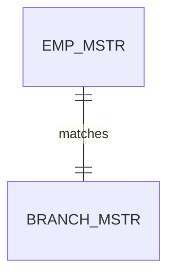
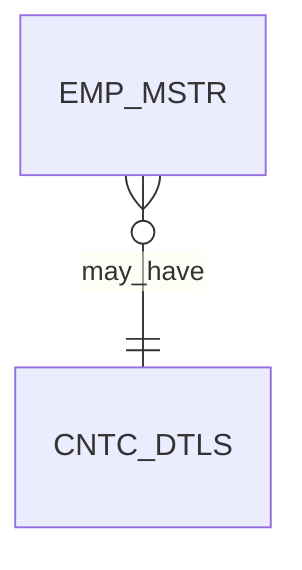
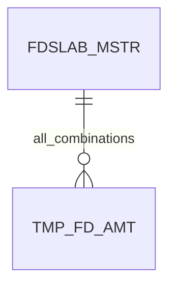
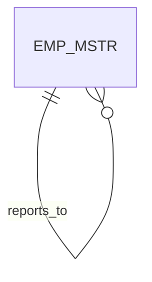
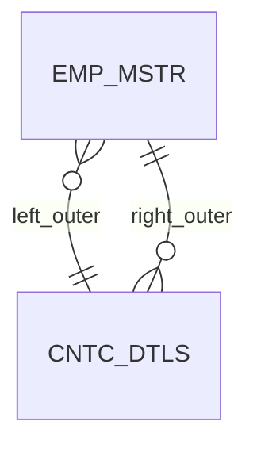
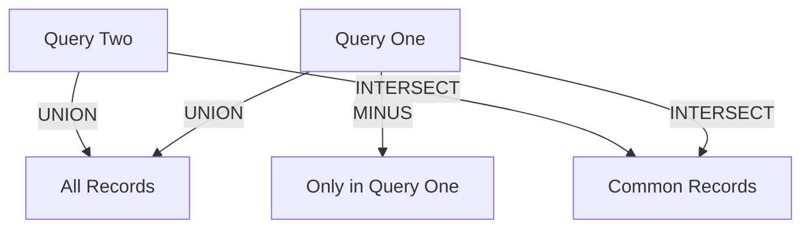

# JOINS
Sometimes it is necessary to work with multiple tables as though they were a single entity. 
Then a single SQL sentence can manipulate data from all the tables. 
Joins are used to achieve this.

Tables are joined on columns that have the same data type and data width in the tables.
we use `keys` to relate the data
`PRIMARY KEY` is a column with a unique value for each row; hence can be used for every major operation

## Types of Joins

### 1. Inner Join
Inner joins return rows where there is a match in both tables. Most common join type.

**Example:**
```sql
SELECT E.EMP_NO, (E.FNAME || ' ' || E.MNAME || ' ' || E.LNAME) "Name", B.NAME "Branch"
FROM EMP_MSTR E INNER JOIN BRANCH_MSTR B
ON B.BRANCH_NO = E.BRANCH_NO;
```

**Mermaid Diagram:**


---

### 2. Outer Join
Outer joins return all rows from one table and matched rows from the other. Unmatched rows get NULLs.

**Example (Left Outer Join):**
```sql
SELECT E.FNAME, E.LNAME, E.DEPT, C.CNTC_TYPE, C.CNTC_DATA
FROM EMP_MSTR E LEFT JOIN CNTC_DTLS C ON E.EMP_NO = C.CODE_NO;
```

**Mermaid Diagram:**


---

### 3. Cross Join
Cross joins return the Cartesian product of two tables (all possible combinations).

**Example:**
```sql
SELECT T.FD_AMT, S.MINPERIOD, S.MAXPERIOD, S.INTRATE,
	ROUND(T.FD_AMT * (S.INTRATE/100) * (S.MINPERIOD/365)) "Amt_Min_Period",
	ROUND(T.FD_AMT * (S.INTRATE/100) * (S.MAXPERIOD/365)) "Amt_Max_Period"
FROM FDSLAB_MSTR S CROSS JOIN TMP_FD_AMT T;
```

**Mermaid Diagram:**


---

### 4. Self Join
Self joins are used to join a table to itself, often to relate rows within the same table.

**Example:**
```sql
SELECT EMP.FNAME "Employee", MNGR.FNAME "Manager"
FROM EMP_MSTR EMP, EMP_MSTR MNGR
WHERE EMP.MNGR_NO = MNGR.EMP_NO;
```

**Mermaid Diagram:**


---

## Notes
- Use keys to relate tables.
- Always specify join conditions to avoid Cartesian products unless intended.
- Use aliases for clarity when joining tables, especially for self joins.


---

## Advanced Join Concepts

### ANSI vs Theta Join Syntax
**ANSI-style:**
```sql
SELECT <columns>
FROM Table1 INNER JOIN Table2
ON Table1.col = Table2.col
WHERE <condition>;
```
**Theta-style:**
```sql
SELECT <columns>
FROM Table1, Table2
WHERE Table1.col = Table2.col AND <condition>;
```

---

### Joining Multiple Tables
You can join more than two tables by chaining join conditions.
```sql
SELECT C.CUST_NO, C.FNAME, A.ACCCT_NO, B.NAME, A.CURBAL
FROM CUST_MSTR C
INNER JOIN ACCT_FD_CUST_DTLS A ON C.CUST_NO = A.LCUST_NO
INNER JOIN ACCT_MSTR B ON A.ACCCT_NO = B.ACCCT_NO
INNER JOIN BRANCH_MSTR D ON B.BRANCH_NO = D.BRANCH_NO;
```

---

### Adding WHERE Clause to Joins
You can filter joined results using WHERE.
```sql
SELECT E.EMP_NO, E.FNAME, B.NAME
FROM EMP_MSTR E INNER JOIN BRANCH_MSTR B ON B.BRANCH_NO = E.BRANCH_NO
WHERE E.DEPT = 'Administration';
```

---

### LEFT and RIGHT OUTER Joins
**LEFT OUTER JOIN:** Returns all rows from the left table, matched rows from the right.
```sql
SELECT E.FNAME, E.LNAME, E.DEPT, C.CNTC_TYPE, C.CNTC_DATA
FROM EMP_MSTR E LEFT JOIN CNTC_DTLS C ON E.EMP_NO = C.CODE_NO;
```
**RIGHT OUTER JOIN:** Returns all rows from the right table, matched rows from the left.
```sql
SELECT E.FNAME, E.LNAME, E.DEPT, C.CNTC_TYPE, C.CNTC_DATA
FROM CNTC_DTLS C RIGHT JOIN EMP_MSTR E ON C.CODE_NO = E.EMP_NO;
```

**Mermaid Diagram:**


---

### Guidelines for Joins
- Prefix column names with table names for clarity.
- Use aliases to avoid ambiguity, especially in self joins.
- Always include the WHERE clause in join statements.
- Data types and column counts must match for UNION/INTERSECT/MINUS.

---

### Concatenating Data from Table Columns
You can join string literals and column values for readable output.
```sql
SELECT 'ACCOUNT NO. ' || ACCT_NO || ' WAS INTRODUCED BY CUSTOMER NO. ' || INTRO_CUST_NO || ' AT BRANCH NO. ' || BRANCH_NO AS "Accounts Opened"
FROM ACCT_MSTR;
```

---

### UNION, INTERSECT, MINUS Clauses
**UNION:** Combines results from two queries, removes duplicates.
```sql
SELECT CUST_NO FROM CUST_MSTR WHERE CITY = 'Mumbai'
UNION
SELECT EMP_NO FROM EMP_MSTR WHERE CITY = 'Mumbai';
```
**INTERSECT:** Returns only rows common to both queries.
```sql
SELECT CUST_NO FROM ACCT_FD_CUST_DTLS WHERE ACCT_FD_NO LIKE 'CA%'
INTERSECT
SELECT CUST_NO FROM ACCT_FD_CUST_DTLS WHERE ACCT_FD_NO LIKE 'FS%';
```
**MINUS:** Returns rows from the first query not present in the second.
```sql
SELECT CUST_NO FROM ACCT_FD_CUST_DTLS WHERE ACCT_FD_NO LIKE 'CA%'
MINUS
SELECT CUST_NO FROM ACCT_FD_CUST_DTLS WHERE ACCT_FD_NO LIKE 'FS%';
```

**Mermaid Diagram:**


---

## Summary Table
| Join Type      | Description                                      |
|--------------- |--------------------------------------------------|
| Inner Join     | Rows with matches in both tables                  |
| Left Outer     | All rows from left, matched from right            |
| Right Outer    | All rows from right, matched from left            |
| Cross Join     | All combinations (Cartesian product)              |
| Self Join      | Table joined to itself                            |
| UNION          | Combines results, removes duplicates              |
| INTERSECT      | Common rows in both queries                       |
| MINUS          | Rows in first query not in second                 |