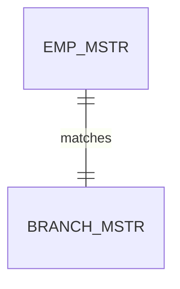
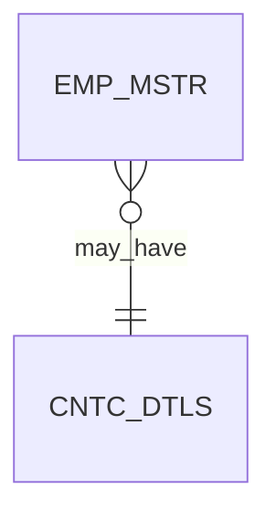
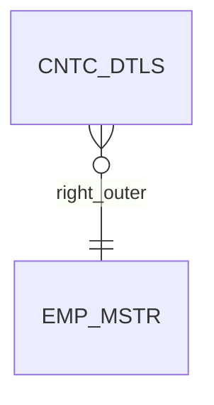
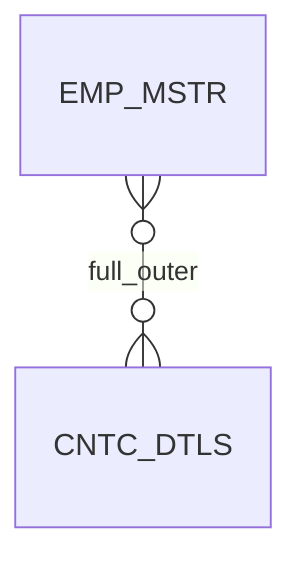
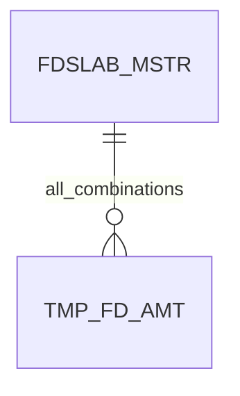
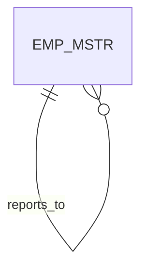
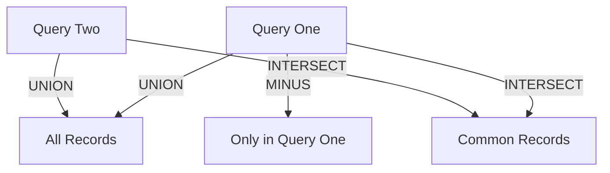

# JOINS

> **Dialect note:** Oracle/ANSI syntax (the legacy theta style in the self-join and `MINUS` are Oracle-valid; MySQL uses `EXCEPT` for MINUS).

### What a Join Is
#### Explain It
Sometimes one query must treat several tables as a single entity: a join combines rows from two or more tables by matching columns that share the same type and meaning — normally keys. The PRIMARY KEY of one table (a column unique per row) is used to relate to the FOREIGN KEY of another. Joins let a single SELECT read related data without keeping redundant copies.

#### Prove It
```sql
SELECT E.EMP_NO, (E.FNAME || ' ' || E.MNAME || ' ' || E.LNAME) "Name", B.NAME "Branch"
FROM EMP_MSTR E INNER JOIN BRANCH_MSTR B
  ON B.BRANCH_NO = E.BRANCH_NO;
```

#### Gotchas / Edge Cases
- Always specify the join condition; forgetting it produces a Cartesian product (every row × every row).
- Prefix columns with the table alias — ambiguous names (both tables having `NAME`) raise errors if unqualified.

---

### INNER JOIN
#### Explain It
The inner join returns rows only where a match exists in **both** tables — unmatched rows on either side are dropped. It is the default and most common join, and the answer to "show me employees with their branch" when you only care about employees that have a branch.

#### Prove It
```sql
SELECT E.EMP_NO, (E.FNAME || ' ' || E.MNAME || ' ' || E.LNAME) "Name", B.NAME "Branch"
FROM EMP_MSTR E INNER JOIN BRANCH_MSTR B
  ON B.BRANCH_NO = E.BRANCH_NO;
```

**Mermaid Diagram:**

```mermaid
erDiagram
	EMP_MSTR ||--|| BRANCH_MSTR : matches
```

#### Gotchas / Edge Cases
- `INNER` is optional (`JOIN` alone means inner) — saying "JOIN == INNER JOIN" impresses, but only when tables have ON conditions.
- If a key matches multiple rows, you get all combinations (a join fan-out) — row counts can exceed both input tables.

---

### LEFT OUTER JOIN
#### Explain It
A left join returns **all rows from the left table**, plus matched rows from the right table; when no match exists the right-side columns are filled with NULL. It answers "every employee, with contact info if they have one". The phrase "LEFT" refers to the direction of the "keep-all" table.

#### Prove It
```sql
SELECT E.FNAME, E.LNAME, E.DEPT, C.CNTC_TYPE, C.CNTC_DATA
FROM EMP_MSTR E LEFT JOIN CNTC_DTLS C ON E.EMP_NO = C.CODE_NO;

-- employees with NO contact at all (anti-join pattern):
SELECT E.FNAME, C.CNTC_TYPE
FROM EMP_MSTR E LEFT JOIN CNTC_DTLS C ON E.EMP_NO = C.CODE_NO
WHERE C.CODE_NO IS NULL;
```

**Mermaid Diagram:**

```mermaid
erDiagram
	EMP_MSTR }o--|| CNTC_DTLS : may_have
```

#### Gotchas / Edge Cases
- Where you put the filter changes the result: moving `WHERE c.code_no IS NULL` into the ON clause gives ALL rows with a NULL-able extra column — the classic "LEFT JOIN + WHERE = INNER JOIN" trap. ON filters *which* rows join; WHERE filters the *output*.
- NULL join keys never match: a left table row with `BRANCH_NO = NULL` matches nothing, so it appears with NULLs on the right side — not an error, but often a surprise.

---

### RIGHT OUTER JOIN
#### Explain It
A right join is the mirror of the left join: **all rows from the right table**, matched rows from the left, NULLs where the left side has no match. Note that this example is written so its result is exactly the previous LEFT JOIN's output — LEFT and RIGHT produce identical row sets when you flip the table order, so many teams standardize on LEFT only.

#### Prove It
```sql
SELECT E.FNAME, E.LNAME, E.DEPT, C.CNTC_TYPE, C.CNTC_DATA
FROM CNTC_DTLS C RIGHT JOIN EMP_MSTR E ON C.CODE_NO = E.EMP_NO;
```

**Mermaid Diagram:**

```mermaid
erDiagram
	CNTC_DTLS }o--|| EMP_MSTR : right_outer
```

#### Gotchas / Edge Cases
- RIGHT JOIN is rare in practice (flip the tables and use LEFT) — the interviewer is usually checking you know it exists.
- Reading order caution: with RIGHT JOIN the "protective" table is the one on the right; people misread the semantics when skimming.

---

### FULL OUTER JOIN
#### Explain It
A full outer join is LEFT + RIGHT combined: **every row from both tables**, matched where possible, NULLs in all unmatched columns. Rows only in the left table, rows only in the right table, and matched rows all appear. It answers "every employee and every contact record, linked where they correspond". (Oracle/Postgres support FULL OUTER JOIN; MySQL does not — the workaround there is `LEFT JOIN ... UNION RIGHT JOIN ...`.)

#### Prove It
```sql
SELECT E.EMP_NO, C.CODE_NO
FROM EMP_MSTR E FULL OUTER JOIN CNTC_DTLS C ON E.EMP_NO = C.CODE_NO;

-- the "only-unmatched" version: EVERYTHING with no counterpart
SELECT E.EMP_NO, C.CODE_NO
FROM EMP_MSTR E FULL OUTER JOIN CNTC_DTLS C ON E.EMP_NO = C.CODE_NO
WHERE E.EMP_NO IS NULL OR C.CODE_NO IS NULL;
```

**Mermaid Diagram:**

```mermaid
erDiagram
	EMP_MSTR }o--o{ CNTC_DTLS : full_outer
```

#### Gotchas / Edge Cases
- FULL OUTER = "keep everything": it is the join used to find *orphan records on both sides* in reconciliation reports.
- MySQL's lack of FULL OUTER JOIN is a classic dialect interview point: the emulation is `LEFT JOIN ... UNION ... RIGHT JOIN ... WHERE IS NULL`.
- A FULL OUTER JOIN on tables with both NULL keys and real keys produces three kinds of rows — NULL keys match only their own emptiness, they never "match" real keys.

---

### CROSS JOIN (Cartesian Product)
#### Explain It
A cross join pairs **every row of one table with every row of the other** — no condition, all combinations. When deliberate it is useful (rate tables × amount tables, date dimensions × fact tables); accidental (missing ON clause) it is the classic performance disaster: 1,000 × 1,000 rows explode into 1,000,000.

#### Prove It
```sql
SELECT T.FD_AMT, S.MINPERIOD, S.MAXPERIOD, S.INTRATE,
       ROUND(T.FD_AMT * (S.INTRATE/100) * (S.MINPERIOD/365)) "Amt_Min_Period",
       ROUND(T.FD_AMT * (S.INTRATE/100) * (S.MAXPERIOD/365)) "Amt_Max_Period"
FROM FDSLAB_MSTR S CROSS JOIN TMP_FD_AMT T;
```

**Mermaid Diagram:**

```mermaid
erDiagram
	FDSLAB_MSTR ||--o{ TMP_FD_AMT : all_combinations
```

#### Gotchas / Edge Cases
- Row count = |left| × |right|; for 3-way cross joins it multiplies again.
- Old-style implicit cross product: `FROM a, b` without a WHERE is the same thing — and the reason linters demand explicit join keywords.

---

### SELF JOIN
#### Explain It
A self join joins a table **to itself**, usually to relate rows within one table — the classic boss/employee hierarchy. Two aliases of the same table act as two logical copies, and the join condition is a self-referential foreign key (EMP.MNGR_NO = MNGR.EMP_NO). The style below is the legacy "theta" syntax; modern Oracle prefers ANSI `JOIN ... ON` with the same aliases.

#### Prove It
```sql
SELECT EMP.FNAME "Employee", MNGR.FNAME "Manager"
FROM EMP_MSTR EMP, EMP_MSTR MNGR
WHERE EMP.MNGR_NO = MNGR.EMP_NO;
```

**Mermaid Diagram:**

```mermaid
erDiagram
	EMP_MSTR ||--o{ EMP_MSTR : reports_to
```

#### Gotchas / Edge Cases
- Aliases are **mandatory** — `EMPLOYEE JOIN MANAGER` unaliased is a syntax error and ambiguous.
- The top of the hierarchy has a NULL manager, so it disappears from an INNER self join — use a LEFT self join (or COALESCE) to show the root rows.
- "Employee → Manager → Manager's Manager" recursion is a join one level at a time; unlimited depth needs hierarchical queries (`advance-feat.md`).

---

### ANSI vs Theta (Old-Style) Join Syntax
#### Explain It
ANSI-style joins put the condition in `ON` (`A INNER JOIN B ON a.id = b.id`); the older theta style puts it in the WHERE clause (`FROM A, B WHERE a.id = b.id`). Both are valid in Oracle and PostgreSQL; the ANSI form is preferred because the join logic is separated from filtering and it is portable. Notably, MySQL silently needs the ON form for LEFT/RIGHT joins — legacy syntax there just ignores the "left" behavior without proper conditions.

#### Prove It
```sql
-- ANSI-style:
SELECT E.FNAME, B.NAME
FROM EMP_MSTR E INNER JOIN BRANCH_MSTR B ON B.BRANCH_NO = E.BRANCH_NO
WHERE E.DEPT = 'MIS';

-- theta-style (same result):
SELECT E.FNAME, B.NAME
FROM EMP_MSTR E, BRANCH_MSTR B
WHERE B.BRANCH_NO = E.BRANCH_NO AND E.DEPT = 'MIS';
```

#### Gotchas / Edge Cases
- In old Oracle syntax, a LEFT/OUTER is written with `(+)` on the optional side (`WHERE B.BRANCH_NO(+) = E.BRANCH_NO`) — recognizing it when reading legacy code scores points, but never write it.
- Theta syntax that forgets the join condition silently becomes a CROSS JOIN — ANSI syntax makes the intent visible.

---

### Natural Join vs Equijoin
#### Explain It
An **equijoin** is any join whose condition uses only equality (`ON a.col = b.col`). A **natural join** (`NATURAL JOIN`) is a shorthand equijoin where Oracle automatically matches *all* columns with the same name in both tables — no `ON` clause needed. Because the matching is implicit, `NATURAL JOIN` is risky in production: adding a column with the same name to both tables silently changes the join semantics.

#### Prove It
```sql
-- equijoin: explicit, safe, the standard form
SELECT E.EMP_NO, B.NAME, B.BRANCH_NO
FROM EMP_MSTR E JOIN BRANCH_MSTR B ON B.BRANCH_NO = E.BRANCH_NO;

-- natural join: Oracle matches all identically-named columns automatically
SELECT EMP_NO, NAME, BRANCH_NO
FROM EMP_MSTR NATURAL JOIN BRANCH_MSTR;
-- equivalent to the equijoin above ONLY because BRANCH_NO is the only shared name
```

#### Gotchas / Edge Cases
- `NATURAL JOIN` matches **every** column with the same name in both tables — if both tables gain a `STATUS` column later, the join suddenly filters on `STATUS` too, with no code change.
- Oracle supports `NATURAL LEFT JOIN` / `NATURAL RIGHT JOIN`; the implicit matching still applies.
- Most style guides ban `NATURAL JOIN` in production for the reason above — "explicit is better than implicit" is the interview-safe line.
- `USING(col)` is a compromise: it declares the join column(s) explicitly but lets you reference them without a table qualifier (`SELECT col ...` not `SELECT a.col ...`).

---

### Joining Multiple Tables
#### Explain It
Joins chain: the result of one join becomes the input of the next, so three, four or more tables can be linked in sequence. In a bank schema, customer → account-customer link → account → branch is a typical 4-way chain built entirely from FKs.

#### Prove It
```sql
SELECT C.CUST_NO, C.FNAME, A.ACCT_FD_NO, B.NAME
FROM CUST_MSTR C
INNER JOIN ACCT_FD_CUST_DTLS A ON C.CUST_NO = A.CUST_NO
INNER JOIN BRANCH_MSTR B      ON B.BRANCH_NO = 'B1';
```

#### Gotchas / Edge Cases
- The intermediate join tables must be in the chain or you get duplications/false matches (multi-table fan-out).
- Keep the ON conditions on the *pair* being joined at each step — joining `A` to `C` in step 2 while `B` is where C lives is the classic wrong-condition bug.

---

### Set Operations: UNION, INTERSECT, MINUS
#### Explain It
Set operations combine whole result sets, not columns: **UNION** merges two queries' rows and removes duplicates (UNION ALL keeps them — much faster), **INTERSECT** returns only rows present in both results, and **MINUS** (Oracle/Postgres) returns rows in the first query but not the second (MySQL/SQL Server: `EXCEPT`). Column counts and types must match.

#### Prove It
```sql
SELECT CUST_NO FROM ACCT_FD_CUST_DTLS WHERE ACCT_FD_NO LIKE 'CA%'
UNION
SELECT CUST_NO FROM ACCT_FD_CUST_DTLS WHERE ACCT_FD_NO LIKE 'SB%';
```
```sql
SELECT CUST_NO FROM ACCT_FD_CUST_DTLS WHERE ACCT_FD_NO LIKE 'CA%'
INTERSECT
SELECT CUST_NO FROM ACCT_FD_CUST_DTLS WHERE ACCT_FD_NO LIKE 'FS%';
```
```sql
SELECT CUST_NO FROM ACCT_FD_CUST_DTLS WHERE ACCT_FD_NO LIKE 'CA%'
MINUS
SELECT CUST_NO FROM ACCT_FD_CUST_DTLS WHERE ACCT_FD_NO LIKE 'FS%';
```

**Mermaid Diagram:**

```mermaid
graph TD
	A[Query One] -->|UNION| C[All Records]
	B[Query Two] -->|UNION| C
	A -->|INTERSECT| D[Common Records]
	B -->|INTERSECT| D
	A -->|MINUS| E[Only in Query One]
```

#### Gotchas / Edge Cases
- Matching rule: same number of columns and compatible types — `NUMBER` vs `VARCHAR2` misalignment is the classic ORA-01790/01791 error pair.
- `UNION` sorts/dedups, `UNION ALL` doesn't — on big sets UNION ALL is dramatically faster; the interview one-liner is "use UNION ALL when you know there are no duplicates".
- `MINUS` vs `EXCEPT` is the dialect tell: Oracle and PostgreSQL say MINUS; MySQL and SQL Server say EXCEPT.

---

## Summary Table
| Join Type      | Description                                      | NULLs where?            |
|--------------- |--------------------------------------------------|-------------------------|
| INNER JOIN     | Rows with matches in **both** tables             | never                   |
| LEFT OUTER     | All rows from left, matched from right           | right side of misses    |
| RIGHT OUTER    | All rows from right, matched from left           | left side of misses     |
| FULL OUTER     | All rows from both tables                        | both sides of misses    |
| CROSS JOIN     | All combinations (Cartesian product)             | n/a (no condition)      |
| SELF JOIN      | Table joined to itself via aliases               | as per chosen join type |
| UNION          | Combines results, removes duplicates             | n/a (row-set op)        |
| INTERSECT      | Common rows in both queries                      | n/a (row-set op)        |
| MINUS          | Rows in first query not in second                | n/a (row-set op)        |